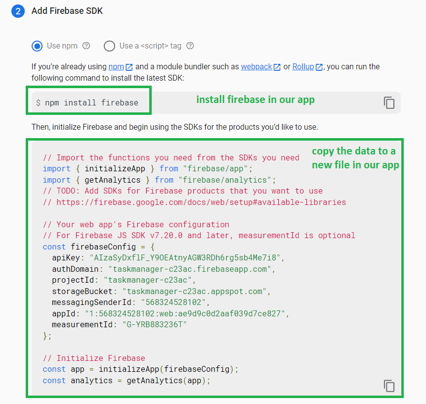
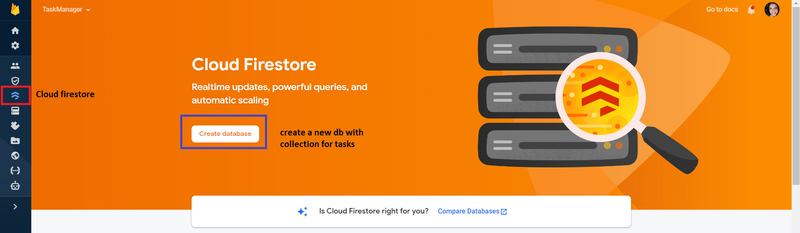
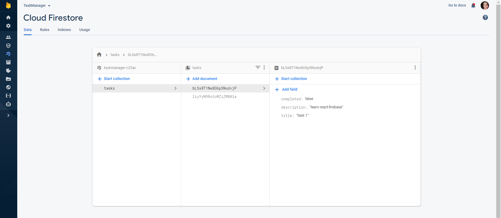

# Connect react with database - firebase

* We can store data in any type of database: SQL / NO-SQL. 
* In our app now - we will use firebase - it is a NO-SQL database. 
* Firebase is built by Google. 

## Example:

* Go to firebase website: https://firebase.google.com/

* Create an account and login. 

* press the button -> `go to console`

* Add project, with name: `TaskManager`

* go to web app

* register app: give a name: `task-manager`

* The important data: 
    A. install firebase
    B. copy the data to a new file in `src/firebase-config.js`

* Go to firestore: 

* create database
* start in test mode!! important!
* pick a location - default for now. 

* Add a collection `tasks` with 2 documents: `task 1` & `task 2`

For each task - 
    * title (string)
    * description (string)
    * completed (boolean)

 

